```{r setup, include=FALSE}
knitr::opts_chunk$set(echo = TRUE)

# Load Libraries
library(knitr)
library(tinytex)
```


\newpage
# Abstract

## Aim
This study aimed to explore social, family, and personal factors influencing mental health concerns (MHC) and associated relationships, among youth aged 6-17 using the 2022 National Survey of Children's Health dataset.

## Methods
The analysis utilized a various number of statistical approaches including logistic regression models, random forest classification, gradient boosting machines (GBM), and principal component analysis (PCA). Over 20 independent variables were identified as factors for analysis to be examined as potential risk factors. Accuracy, sensitivity, specificity, and area under the ROC curve (AUC) were al;l used to gauge model performance.

## Results
With accuracies over 80% and reaching a peak of 84.6%, the different machine learning models indicated strong predictive performance. The main predictors were gender, degree of physical activity, involvement in after-school activities, and bullying experiences. Significant correlations between higher levels of physical exercise and after-school involvement and less mental health issues were found using logistic regression models. On the other hand, there was a clear correlation between heightened mental health issues and experiences of bullying and prejudice. These behavioral and social characteristics were consistently found to be the main predictors by variable importance analysis across several models.

## Conclusion
By highlighting the characteristics of mental health issues and identifying important risk variables, this study contributed to our understanding of teenage mental health. The results highlight the value of our many strategies for promoting physical exercise, social interaction through planned events, and anti-bullying measures in promoting the mental health of adolescents. The models' high predictive performance points to the possibility of creating instruments to identify people who are at risk.


\newpage
# Background
Mental health concerns represent one of the most pressing public health challenges among adolescents in the 21st century. These concerns can arise from  individual development, family functioning, and societal well-being. Globally, approximately 1 in 7 youth experience a mental health disorder, and higher rates are presented in the United States [**[1]**](#link1). The adolescent period represents a critical developmental window for mental health, with the World Health Organization (WHO) suggest that, in adults, half of all mental health disorders begin by the age 18, though most cases remain undetected and untreated [**[2]**](#link1). Moreover, mental health conditions account for 16% of the global burden of disease and injury among adolescents, with depression, anxiety, and behavioral disorders among the leading causes of illness and disability in this population [**[2]**](#link2). Furthermore, other studies suggest the association between social withdraw and mental health, suggesting a reverse interaction that those more involved in social frameworks may have a positive impact on an individual's mental health [**[3]**](#ref3).

The COVID-19 pandemic has further worsened these concerns, with emergency room visits for mental health related concerns increasing by 24% for children aged 5-11 and 31% for adolescents aged 12-17 during 2020 compared to 2019 [**[9]**](#ref7). These statistics underscore the critical importance of identifying key risk and protective factors to inform targeted interventions for this vulnerable population.


## Digital Age Challenges
In today's modern era of digital technologies, it is becoming increasing difficult for adolescents to avoid screens and social media. Adolescent screen exposure has drastically increased in recent years, through both educational platforms (such as Canvas learning management systems) and social media applications (including Snapchat and TikTok). The average American adolescent spends about 7 hours daily using screen time for media entertainment and this excludes school work [**[12]**](#ref8). This unprecedented level of digital engagement represents a significant environmental factor that warrants examination in relation to mental health outcomes.


## Risk Factors
Current research suggests that adolescent mental health is influenced by a various number of intertwined factors. These factors do not operate in isolation but rather "interact and are closely interconnected, directly or indirectly contributing to adolescent psychopathology"[**[10]**](#ref4).

### Individualized Factors
Individual characteristics such as age, sex, race/ethnicity, physical activity levels, and screen time usage have been identified as significant predictors of mental health concerns. Studies have found that "rates of increase in depression are higher for girls than for boys; the same is true for rates of overanxious disorder" [**[8]**](#ref5). These findings support the inclusion of demographic and behavioral variables in predictive models of adolescent mental health.

### Family Environment
The family environment and family history play a crucial role in shaping adolescent mental health outcomes. Family structure, parental mental health, and the quality of family relationships significantly impact youth development, with research emphasizing that "parents' interactions with their children are among the strongest proximal predictors of children's neurodevelopment" and that "the family environment, with all its complexity and diverse components, plays a critical role in shaping neurodevelopmental outcomes in children" [**[6]**](#ref6).

### Socail Connections
Social connections and peer relationships represent another critical avenue influencing adolescent mental health. The WHO notes that "factors that can contribute to stress during adolescence include exposure to adversity, pressure to conform with peers and exploration of identity" [**[1]**](#link1). This study examines variables related to after-school activities, event participation, and mentorship to assess the risk/reward effects on mental health concerns.

### Community and Neighborhood Factors
The broader social environment, including neighborhood safety and support, significantly influences adolescent mental health. "Some adolescents are at greater risk of mental health conditions due to their living conditions, stigma, discrimination or exclusion, or lack of access to quality support and services" [**[1]**](#link1). Continually, this study examines to further include neighborhood safety, support, and community-level adverse childhood experiences to assess the impacts on mental health concerns.

### Adverse Experiences
Exposure to adverse experiences represents a significant risk factor for poor mental health outcomes. "Violence (especially sexual violence and bullying), harsh parenting and severe socioeconomic problems are recognized risks to mental health" [**[1]**](#link1). Lastly, this study incorporates measures of bullying, victimization, adverse childhood experiences, discrimination, and household adversities to comprehensively assess the impact of negative experiences on mental health.

## Analytical Approach
Given the complex and tangled nature of these factors influencing adolescent mental health, this study employs both traditional statistical approaches and advanced machine learning methodologies to identify key predictors and their interactions. The multilevel nature of these risk factors—operating across individual, family, social, community, and experiential domains—necessitates sophisticated analytical approaches capable of capturing complex interactions and non-linear relationships. This study aims to contribute an understanding of the various factors determinant of mental health concerns in adolescents, with findings intended to inform future strategies addressing some of the potential influential risk factors.


\newpage
# Study Design
This study aimed to examine the relationships influencing mental health concerns among youth aged 6-17 years. The primary aim was to identify and quantify the interaction of individual, family, and social factors and the association with mental health concerns in children and adolescents, utilizing both traditional statistical approaches and advanced machine learning methodologies.

## Aims
1. To determine the relative importance of different risk factors being: individual characteristics, family environment, social connections, adverse experiences, and neighborhood factors, in predicting mental health outcomes.

2. To evaluate the predictive performance of various analytical approaches, including logistic regression, regularized regression, ensemble methods, and principal component analysis-based models.

3. To examine interaction between various social factors being: after school activities, bullying, and neighborhood support in predicting mental health concerns.

4. To identify the most influential set of predictors that can effectively classify mental health risk.

## Population Selection

### Target Population
The study population consisted of children and adolescents aged 6-17 years participating in the 2022 NSCH. This age range was selected to capture the critical developmental period during which many mental health conditions first emerge and when social, academic, and family environmental factors become increasingly influential.

### Sampleing
The NSCH employs a complex probability sampling design to produce nationally representative estimates. The survey utilizes a two-sections:
- Section 1: Four questions about the presence of children in the home\
- Section 2: Detailed questions on the demographics and health of children\

Survey results were taken as is and the following criteria was applied:
- Children aged 6-17 years at the time of survey administration\
- Complete or sufficiently complete data on the primary outcome variable (mental health concerns)\

Following data cleaning, the analytical dataset was comprised over 20,000 observations. The large sample size allows for the estimation of interaction affects and supported the implementation of data-intensive machine learning algorithms while maintaining sufficient sample size for model validation through train-test splitting procedures.

\newpage
## Data and Materials
### Data Source
This analysis utilized the 2022 National Survey of Children's Health (NSCH), conducted by the U.S. Census Bureau in partnership with the Health Resources and Services Administration's Maternal and Child Health Bureau. The NSCH is an annual cross-sectional survey designed to produce national and state-level estimates of child health and well-being across multiple domains.

### Survey Design
The survey is primarily a mail-based data collection survey with online and telephone completion options. The survey domains, examined in this research include:
- Child health
- Healthcare access
- Family dynamics and support systems
- Neighborhood characteristics
- School engagement
- Adverse childhood experiences

### Dataset
The final dataset was a subset from the `NSCH_2022e_Topical_CSV_CAHMI_DRCv2.csv`. The original data contained over 300 survey collection variables as well as over 200 calculated variables based on the provide codebook. In total, the codebook contains $579$ variables. An alternate version of the unaltered dataset can be found on [**census.gov**](#link3). 

A smaller subset of this data was created for the purposes of this research and can be found in the project github available in the [**resources**](#support).

#### Dataset Documentation
Comprehensive variable documentation was utilized to provide details regarding the data for each factor. The Methodology Report includes details such as:\
- Response categories and value labels\
- Skip patterns and logical consistency rules\
- Data collection methodology for each survey module\

The complete data dictionary with variable definitions and descriptions was utilized via the [**NSCH Codebook**](#link4). An amended version of the variable dictionary, comprised of all the variables used in the research analysis, can be found in [**resources**](#support).

\newpage
# Statistical Analysis
The study employed a comprehensive analytical approach combining traditional statistical methods with advanced machine learning techniques to examine predictors of mental health concerns among adolescents.

## Reproducibility
Analysis code was version-controlled and documented to ensure reproducibility. A Random seed was set a `seed = 1776` for all procedures to enable exact replication of results.

## Response Variable
The primary outcome variable was mental health concerns `MHealthConcern`, constructed as a binary indicator based on responses to survey questions regarding current mental health conditions. More specifically, the indicator to into account the variables `K2Q33B` and `K2Q32B`, indicating whether their child currently has depression or anxiety. If the response was "yes" to either condition, the resulting value was "yes".

## Explanatory Variables (Risk Factors)
A total of 22 predictor variables were selected based on theoretical relevance, personal experience, and previous literature. There are 6 main factors that group the predictors: individual-level factors, social and family factors, neighborhood factors, adverse experience factors, parental mental health factors, and school engagement factors.

**Individual-level factors:**\
- child's age `SC_AGE_YEARS`\
- sex `sex_22`\
- race/ethnicity `SC_RACE_R`\
- physical activity level `PHYSACTIV`\
- screen time usage `ScreenTime_22`\
- age group category ``age3_22`\

**Social and family environment factors:**\
- household composition `FAMILY_R`\
- after-school activity participation `AftSchAct_22`\
- event participation `EventPart_22`\
- mentor availability `mentor_22`\
- ability to share ideas with family `ShareIdeas_22`\

**Neighborhood factors:**\
- neighborhood safety `NbhdSafe_22`\
- neighborhood support `NbhdSupp_22`\
- community-level ACEs `ACE4ctCom_22`\

**Adverse experience factors:**\
- bullying `bully_22`\
- victim of bullying `bullied_22`\
- adverse childhood experiences count `ACEct11_22`\
- discrimination experiences `ACE12`\
- household adverse experiences `ACE6ctHH_22`\

**Parental mental health factors:**\
- mother's mental health status `MotherMH_22`\
- father's mental health status `FatherMH_22`\

**School engagement factors:**\
- school connection measure `K8Q35`\

## Data Processing
### Missing Data Imputation
Missing data were addressed using Multiple Imputation by Chained Equations (MICE) implemented in R. The imputation model utilized predictive mean matching (PMM) with 5 imputed datasets and 50 iterations to ensure convergence. Complete case analysis was performed on the imputed dataset to maintain statistical power while preserving the integrity of relationships between variables. This dataset was saved an utilized in python for PCA.

## Analytical Approaches
Univariate and bivariate analyses were conducted to examine the distribution of mental health concerns across predictor variables. Proportional differences were visualized using grouped bar charts and cross-tabulations to identify preliminary associations.

## Statistical Models
### Logistic Regression
Multiple logistic regression models were fitted to examine associations between predictor variables and mental health outcomes. The six domain-specific models, described above, were developed to systematically examine different frameworks. 

## Machine Learning Approaches
### Regularized Logistic Regression
To address potential multicollinearity and perform variable selection, elastic net regularization was implemented using the glmnet package. The optimal lambda parameter was selected through 5-fold cross-validation, with $\alpha 0.5$ to balance ridge and lasso penalties.

### Random Forest Classification
Random forest models were implemented using 500 trees with importance calculations enabled. The dataset was split into training (70%) and testing (30%) sets using stratified sampling to maintain outcome distribution balance.

### Gradient Boosting Machine
GBM models were fitted with 500 trees, interaction depth of 3, and shrinkage parameter of 0.05. Optimal tree count was determined using out-of-bag error estimation.

\newpage
## Principal Component Analysis (PCA)
PCA was performed on standardized predictor variables to identify underlying latent constructs and reduce dimensionality while preserving maximum variance. The optimal number of components was determined using multiple criteria:

- Kaiser criterion (eigenvalues > 1)\
- Cumulative variance explained (80% threshold)\
- Scree plot examination for elbow identification\

### Componet Analysis
Principal component loadings were examined to understand the contribution of original variables to each component, with visualization through heatmaps to identify variable clustering patterns.

### PCA Modeling
Logistic regression and random forest models were fitted using the selected principal components as predictors to compare performance with original variable models.

## Model Evaluation
### Performance Metrics
Model performance was evaluated using various metrics for binary classification:

- Area Under the ROC Curve (AUC): Primary metric for model discrimination ability
- Accuracy: Overall correct classification rate
- Sensitivity (Recall): True positive rate
- Specificity: True negative rate
- Precision: Positive predictive value

### Model Comparison
Models were compared using Area Under the ROC Curve (AUC) as the primary performance metric, with additional evaluation using accuracy, sensitivity, specificity, and precision. ROC curve analysis was employed to assess model discrimination ability and compare performance across different analytical approaches.

## Analysis Environments
All analyses were conducted using R version 4.x and Python 3.x. Key R packages included: mice (imputation), glmnet (regularized regression), randomForest, gbm, caret (model training), and pROC (ROC analysis). Python analyses utilized scikit-learn, pandas, and numpy libraries.

Statistical significance was set at α = 0.05 for all tests, with 95% confidence intervals reported for odds ratios and effect estimates.

The full list of packages and version can be found in the [**supporting code and resources**](#support) section.


\newpage
# Results
The final dataset comprised $23,572$ participants aged 6-17 years from the 2022 National Survey of Children's Health. Mental health concerns (MHC) were present in $19.3%$ of the sample ($n = 4,550$), while $80.7%$ ($n = 19,022$) reported no mental health concerns. Note that the MHC was determined via an individual having reported previous or current signs of depression or anxiety.

## Variable Distributions
Key demographic and behavioral variables demonstrated expected distributions. Age ranged from $6$ to $17$ years old with a mean of $12$. Gender distribution was about $48%$ female and $52%$ male. Extracurricular activities showed about $80%$ of individuals reported participation in at least $1$ extracurricular activity. For physical activity about $40%$ of the population gets physical activity one to three days a week of 60 minutes or more, while $~10%$ reported no physical activity. $30%$ reported 4-6 days of activity and $~20%$ reported that they get physical activity every day.

[**Figure 2**](#fig2) displays the distribution of mental health concerns in the sample, showing $19.3%$ of participants reported mental health concerns while $80.7%$ did not. [**Figure 4**](#fig4) illustrates the distributions of the top $8$ correlated variables, highlighting differences in distribution between individuals with or without mental health concerns.

## Correlation Analysis
Correlations between predictor variables and mental health concerns revealed a few significant associations [**Figure 1**](#fig1). The strongest correlations were observed for bullied_22 (r = $0.285$), ACEct11_22 (r = $0.275$), ACE4ctCom_22 (r = $0.247$), and ACE6ctHH_22 (r = $0.223$). Variables showing protective associations (negative correlations) included ACE12 (r = $-0.12$) and ShareIdeas_22, while risk factors (positive correlations) included various ACE measures and bullying experiences [**Figure 3**](#fig3).

\newpage
## Traditional Logistic Regression
Six distinct logistic regression models were developed to examine different domains of risk and protective factors.

### Model 1 | Individual Factors
The individual factors model suggested moderate predictive performance (AUC = $0.692$). Age emerged as a significant positive predictor ($\beta = 0.129$, $p < 0.001$), with female sex also associated with increased mental health concerns ($\beta = 0.413$, $p < 0.001$). Race showed significant variation, with some groups demonstrating lower odds of mental health concerns.

### Model 2 | Social and Family Factors
The social and family model showed little less moderate predictive ability (AUC = $0.637$). Family relationship quality demonstrated mixed associations with mental health concerns. After-school activities and event participation were generally associated with increased concerns ($\beta = 0.172$ to $0.244$, $p < 0.05$). Sharing ideas with adults showed the strongest association in this domain ($\beta = 0.497$ to $1.339$, $p < 0.001$), possibly reflecting help-seeking behavior rather than causal relationships.

### Model 3 | Neighborhood Factors
The social and family model showed moderate predictive ability (AUC = $0.637$). Family relationship quality demonstrated mixed associations with mental health concerns. After-school activities and event participation were generally associated with increased concerns ($\beta = 0.172$ to $0.244$, $p < 0.05$). Sharing ideas with adults showed the strongest association in this domain ($\beta = 0.497$ to $1.339$, $p < 0.001$), possibly reflecting help-seeking behavior rather than causal relationships.

### Model 4 | Adverse Experineces
This model had the highest predictive performance (AUC = $0.725$) and suggested the most significant effect sizes. Being bullied showed strong dose-response relationships ($\beta = 0.641$ to $1.902$, all $p < 0.001$), with the highest category demonstrating nearly 7-fold increased odds. Adverse childhood experiences showed steep gradients ($\beta = 0.519$ to $4.087$).

### Model 5 | Parental Mental Health Concerns
Both maternal and paternal mental health showed moderate associations with youth mental health concerns (AUC = $0.634$). Maternal mental health demonstrated stronger effect sizes ($\beta = 0.268$ to $1.000$, all $p < 0.001$) compared to paternal mental health ($\beta = 0.314$ to $0.669$, all $p < 0.001$), suggesting potential associations between parents and child.

### Model 6 | School Engagement
This model demonstrated minimal predictive utility (AUC = $0.509$), with the single school engagement variable showing only a weak association ($\beta = 0.108$, $p < 0.01$). The near-chance AUC suggests that school engagement alone is insufficient for predicting mental health concerns in this population.

### Model Summary
[**Figure 12**](#fig14) outlines the ROC results from the various models tested via logistic regression. Our analysis suggests adverse experiences and individual characteristics are the strongest predictors of adolescent mental health concerns. Adverse experiences demonstrated the most substantial effect, highlighting the profound impact of trauma and victimization on adolescent mental health. Individual demographic and behavioral factors also showed strong predictive utility, particularly age, sex, physical activity, and screen time.

\newpage
## Machine Learning Approaches
Moving forward the complete model of variables will be uitilzed in various machine learning methods.

### Regularized Logistic Regression
Elastic net regularization ($\alpha= 0.5$) was applied to address potential multicollinearity and perform automatic variable selection. The optimal lambda value of $0.000603756$ was determined through 5-fold cross-validation. This approach achieved an AUC of $0.796$The most important predictors identified were bullied_22, ACEct_11 and race.

### Gradient Boosting Machine
The GBM approach achieved an AUC of $0.797$ with optimal performance at $137$ trees. The learning rate of $0.05$ and interaction depth of $3$ provided the best balance between bias and variance. Variable importance rankings were largely consistent with random forest results, with bullied_22 and age emerging as top predictors.

### Random Forest Classification
The random forest model with $500$ trees demonstrated strong predictive performance (AUC = $0.789$, accuracy = $0.827$). Variable importance analysis revealed as the most influential predictors as: age, bullied_22, ScreenTime_22.

### Machine Learning Summary
[**Figure 13**](#fig15) outlines the ROC results from the various machine learning methods. These machine learning approaches achieved AUC values ranging from $0.766$ to $0.796$, representing substantial improvements over individual domain models (AUC range: $0.509$--$0.725$).

Importantly, all three methods consistently identified bullying victimization and age as primary predictors, providing robust evidence for the central role of adverse experiences in adolescent mental health outcomes. The convergent findings across multiple modeling approaches strengthen confidence in the identified risk factors and suggest that comprehensive models incorporating multiple domains substantially outperform single-domain approaches for predicting youth mental health concerns.

## Principal Componet Analysis (PCA)
### PCA Viability Assement
The dataset demonstrated viability for further PCA analysis with a Kaiser-Meyer-Olkin (KMO) measure of $0.586$ and Bartlett's test of sphericity showing statistical significance ($p < 0.001$) and a chi-squared stat of $211523.19$. The correlation matrix revealed sufficient intercorrelations across the various factors suggesting further dimensional reduction.

### Componet Selection
Using the Kaiser criterion (eigenvalues > $1.0$) and cumulative variance thresholds, $5$ principal components were retained, explaining approximately $50%$ of the total variance in the dataset [**Figure 6**](#fig6). The scree plot indicated an optimal number of components at the bending point being at component $5$ [**Figure 5**](#fig5). [**Figure 7**](#fig7) demonstrates that 5 components exceeded the Kaiser criterion threshold of eigenvalue > $1.0$.

#### Component Analysis
[**Table 1**](#tab1) outlines the results from our various measures for each component.

The first principal component (PC1) suggests the most substantial factor, with an eigenvalue of $3.896$ and accounting for $17.71%$ of the total variance. The second component (PC2) contributed an additional $9.93%$ of variance (eigenvalue = $2.185$), while the third component (PC3) explained $8.5%$ of variance (eigenvalue = $1.869$). The remaining components showed progressively smaller contributions to the total variance, with PC4 through PC8 each explaining between $4.55%$ and $7.97%$ of variance individually.

[**Figure 8**](#fig9) shows the 2D distribution of participants along the first two principal components, being PC1 and PC2. There slight separation visible between participants with and without mental health concerns, though with the amount of overlap, it suggests complexity of the relationships.

### PCA Predictive Models
Two machine learning methods were utilized to analyze the principle components:
- Logistic Regression
- Random Forest Classification

#### Model Analysis
[**Table 2**](#tab2) provides the results from the two methods. The logistic regression model achieved an AUC of $0.768$, while the random forest model yielded a nearly identical AUC of $0.766$. These moderate AUC values indicate that both models possess reasonable discriminatory ability, though with room for improvement. Overall accuracy was similarly comparable between models, with logistic regression achieving $82.8%$ accuracy and random forest achieving $82.4%$ accuracy. However, a notable performance pattern emerged when examining sensitivity and specificity metrics. Both models exhibited markedly low sensitivity (logistic regression: $0.212$; random forest: $0.187$), indicating poor ability to correctly identify positive cases.

The low sensitivity values raise concerns about the models' clinical or practical utility, particularly in applications where failing to detect positive cases carries significant consequences.

[**Figure 9**](#fig10) presents the ROC curves for both PCA-based models, showing nearly identical performance between the logistic regression and random forest approaches. [**Figure 10**](#fig11) provides a detailed comparison of performance metrics across both models, highlighting the similar AUC values and the trade-off between sensitivity and specificity. Model calibration analysis [**Figure 11**](#fig12) indicates that both models demonstrate reasonable calibration, particularly in the lower probability ranges, though some deviation from perfect calibration is observed at higher predicted probabilities.


\newpage
# Discussion
## Summary of Results and Methods
This study examined various predictors of mental health concern, utilizing the 2022 National Survey of Children's Health, comprised of $23,572$ adolescent (aged 6-17). Our analysis constructed traditional logistic regression models across six distinct domain factors, advanced machine learning techniques including regularized regression and ensemble methods, and principal component analysis for dimensionality reduction. The study data revealed that $19.3%$ of participants reported mental health concerns, with substantial improvements in predictive performance achieved through machine learning approaches (AUC $0.766-0.796$) compared to traditional single-domain models (AUC $0.509-0.725$).

## Interpretation of Results
### Effects of Bullying
Our findings regarding bullying, specifically bully victimization align strongly with established literature demonstrating the profound impact of peer victimization on adolescent mental health. The relationship observed in our data provides compelling evidence supporting causal pathways between bullying experiences and subsequent mental health concerns. This finding is consistent with meta-analytic evidence showing that bullying victimization increases risk for depression, anxiety, and suicidal ideation in adolescents. The strength of this association in our nationally representative sample underscores bullying as a critical public health concern requiring targeted intervention.

### Effects of Adverse Childhood Experiences
The various adverse experiences effects observed in our data supports the stress sensitization hypothesis, whereby exposure to multiple adverse experiences compounds vulnerability to mental health problems. This finding has important implications for trauma-informed approaches to mental health screening and intervention, suggesting that comprehensive assessment of adversity exposure is essential for understanding individual risk profiles.

### Protective Factors
Several variables traditionally conceptualized as protective factors showed positive associations with mental health concerns in our analysis. After-school activities and event participation were associated with increased rather than decreased mental health concerns. This finding could suggest reverse causation or help-seeking behavior, whereby adolescents experiencing mental health concerns are more likely to be enrolled in structured activities or programs designed to provide support.

## Strengths
### Multi-Method Approach
A key strength of this investigation was the implementation of multiple analytical approaches that provided convergent evidence for the primary findings. The consistency of variable importance rankings across regularized logistic regression, random forest, and gradient boosting methods strengthens confidence in the identified risk factors. This convergent validity across diverse modeling approaches suggests that the observed associations are robust and not artifacts of any single analytical method.

### Dataset
This study leveraged a comprehensive datasets specifically used for our purposes of examining adolescent mental health concerns. The representative sample of $23,572$ participants provides excellent statistical power and generalizability to the United States population of children and adolescents. The comprehensive variable coverage in the NSCH dataset enabled examination of risk factors across multiple domains, including individual, family, school, and community contexts.

### Analysis
The utilization of the various modeling approaches, ranging from logistic regression to machine learning techniques, provided a comprehensive evaluation of predictive factors. The domain-specific factors analysis enabled examination of different frameworks for understanding mental health concerns, while learning from the different strengths of multiple algorithms.

## Limitations
### Study Deisgn
The NSCH's cross-sectional design makes it more difficult to prove a link between predictors and outcomes related to mental health. Prospective longitudinal data would be required to show temporal precedence and rule out reverse causation, even though the associations found for bullying and negative experiences suggested evidence for causal pathways.

### Methodoligcal Limitations
The binary classification of mental health concerns, may not capture the full spectrum of mental health concerns. The focus on depression and anxiety, may have relevance, but excludes other important mental health concerns that may have different risk factor profiles.

Moreover, the multiple imputation approach, possible introduces uncertainty into our analysis. Missing data patterns may not be missing at random, particularly for sensitive topics such as family mental health history and adverse experiences, potentially biasing results.

Lastly, the general complexity of the machine learning models limits interpretability and clinical translation. The idea of the "black box" nature of ensemble methods makes it difficult to understand the inter workings of the methods. Moreover, more complex methods such as neural networks could be utilized but these methods introduce a "darker box" to view into the works and scale of the data and resutls.

\newpage
## Implications
### Clinical Applications
Healthcare providers should prioritize systematic screening for bullying experiences and adverse childhood experiences during routine adolescent health visits. The dose-response relationships observed suggest that both the presence and severity of these experiences should be assessed to appropriately stratify risk and tailor intervention approaches.
The age-related patterns identified in this analysis support the implementation of developmentally-informed mental health services that recognize the increased vulnerability during adolescence. Early identification and intervention during this critical period may prevent the escalation of mental health problems and improve long-term outcomes.

### School Applications
The revolving results around bullying victimization in predicting mental health concerns works to highlight importance of anti-bullying programs in school settings. Evidence-based interventions that target both individual-level factors and school climate should be prioritized as primary prevention strategies.

The development systems for supporting universal prevention, targeted intervention for at-risk youth, and intensive support for those with identified mental health concerns aligns with the suggested findings of this analysis.

## Future Direction
### Longitudinal Studies
Prospective longitudinal research is essential to establish causal relationships between the identified risk factors and mental health outcomes. Various studies conducted at varying time marks, following individuals from childhood through adolescence could clarify the temporal relationships between predictor variables and mental health development. Further studies that incorporate youth self-report, parent report, teacher report, and clinical assessment could provide more comprehensive and accurate assessment of both risk factors and outcomes.

\newpage
# Conclusion
This analysis of a large, nationally representative sample provides robust evidence for the primary role of bullying victimization and adverse childhood experiences in predicting adolescent mental health concerns. The consistent findings across multiple analytical approaches suggest strengthened confidence in the associations and suggest clear targets for prevention and intervention efforts.

The improvements to predictive performance achieved through comprehensive machine learning approaches demonstrates the complex nature of mental health concerns and the value of advanced methods for utilized for understanding these relationships. More traditional models suggested limited predictive utility (AUC $0.509-0.725$), the combination of multiple risk domains through advanced methods achieved meaningful improvements in discriminatory ability (AUC $0.766-0.796$).

The identification of risk factors, particularly bullying victimization with its clear association, provides actionable targets for intervention that could have significant impacts on adolescent mental health. The strength and consistency of these findings across the approaches suggest that investments in anti-bullying programs and trauma-informed interventions represent evidence-based strategies for promoting adolescent mental health.

Future research should prioritize longitudinal designs to establish relationships, to test the effectiveness of targeted prevention programs, and implementation science research to translate these findings into sustainable practice improvements. The foundation provided by this analysis offers an outline for evidence-based research and approaches to understand, predict, and help bend the curve to positively influence the mental health concerns in adolescents.


\newpage
# References

<div id="link1"></div>

**[1]**. World Health Organization. (2024). https://www.who.int/news-room/fact-sheets/detail/adolescent-mental-health

<div id="link2"></div>

**[2]**. World Health Organization. (2024). https://www.who.int/news-room/fact-sheets/detail/adolescents-health-risks-and-solutions/

<div id="link3"></div>

**[3]**. Census. (2022). https://www.census.gov/programs-surveys/nsch/data/datasets/nsch2022.html

<div id="link4"></div>

**[4]**. Census. https://www.census.gov/data-tools/demo/uccb/nschdict

<div id="ref3"></div>

**[5]**. Birrell, L., Werner-Seidler, A., Davidson, L., Andrews, J. L., & Slade, T. (2025). Social connection as a key target for youth mental health. Mental Health & Prevention, 37, 200395. https://doi.org/10.1016/j.mhp.2025.200395

<div id="ref6"></div>

**[6]**. Bush, N. R., Wakschlag, L. S., LeWinn, K. Z., Hertz-Picciotto, I., Nozadi, S. S., Pieper, S., Lewis, J., Biezonski, D., Blair, C., Deardorff, J., Neiderhiser, J. M., Leve, L. D., Elliott, A. J., Duarte, C. S., Lugo-Candelas, C., O'Shea, T. M., Avalos, L. A., Page, G. P., & Posner, J. (2020). Family Environment, Neurodevelopmental Risk, and the Environmental Influences on Child Health Outcomes (ECHO) Initiative: Looking Back and Moving Forward. Frontiers in psychiatry, 11, 547. https://doi.org/10.3389/fpsyt.2020.00547

<div id="ref1"></div>

**[7]**. Fredricks, J. A., & Eccles, J. S. (2006). Is extracurricular participation associated with beneficial outcomes? Concurrent and longitudinal relations. Developmental Psychology, 42(4), 698–713. https://doi.org/10.1037/0012-1649.42.4.698

<div id="ref5"></div>

**[8]**. Institute of Medicine and National Research Council. (2011). The Science of Adolescent Risk-Taking: Workshop Report. National Academies Press.

<div id="ref7"></div>

**[9]**. Leeb RT, Bitsko RH, Radhakrishnan L, Martinez P, Njai R, Holland KM. Mental Health–Related Emergency Department Visits Among Children Aged <18 Years During the COVID-19 Pandemic — United States, January 1–October 17, 2020. MMWR Morb Mortal Wkly Rep 2020;69:1675–1680. DOI: http://dx.doi.org/10.15585/mmwr.mm6945a3

<div id="ref4"></div>

**[10]**. Lin, J., & Guo, W. (2024). The Research on Risk Factors for Adolescents' Mental Health. Behavioral sciences (Basel, Switzerland), 14(4), 263. https://doi.org/10.3390/bs14040263

<div id="ref2"></div>

**[11]**. Loades, M. E., Chatburn, E., Higson-Sweeney, N., Reynolds, S., Shafran, R., Brigden, A., Linney, C., McManus, M. N., Borwick, C., & Crawley, E. (2020). Rapid Systematic Review: The Impact of Social Isolation and Loneliness on the Mental Health of Children and Adolescents in the Context of COVID-19. Journal of the American Academy of Child and Adolescent Psychiatry, 59(11), 1218–1239.e3. https://doi.org/10.1016/j.jaac.2020.05.009

<div id="ref8"></div>

**[12]**. Rideout, V., and Robb, M. B. (2019). The Common Sense census: Media use by tweens and teens, 2019. San Francisco, CA: Common Sense Media.

\newpage
# Supportting Code & Resources

<div id="support"></div>

## Github Project
The complete project results and supporting code can be found [**linked here at github**](https://github.com/assmith23/Mental_Health_Concerns-Adolescents).

## R Packages and Versions

- RColorBrewer | Version 1.1.3
- ggplot2 | Version 3.5.2
- readxl | Version 1.4.5
- tibble | Version 3.2.1
- dplyr | Version 1.1.4
- tidyverse | Version 2.0.0
- writexl | Version 1.5.4
- knitr | Version 1.50
- png | Version 0.1-8
- tinytex | Version 0.57
- imager | Version 1.0.3
- bookdown | Version 0.43
- ROCR | Version 1.0-11
- randomForest | Version 4.7-1.2
- gridExtra | Version 2.3
- caret | Version 7.0-1
- mlbench | Version 2.1-6
- kableExtra | Version 1.4.0
- neuralnet | Version 1.44.2
- naivebayes | Version 1.0.0
- tidyr | Version 1.3.1
- fastDummies | Version 1.7.5
- mice | Version 3.17.0
- corrplot | version 0.95
- car | Version 3.1-3
- glmnet | version 4.1-8
- MASS | version 7.3-65
- pROC | version 1.18.5
- gbm | Version 2.2.2

## Python Packages
The complete list of required python packages can be installed with the same version via the `requirements.txt` in the data folder.

\newpage
# Tables & Figures
## Figures

<div id="fig1"></div>

<center>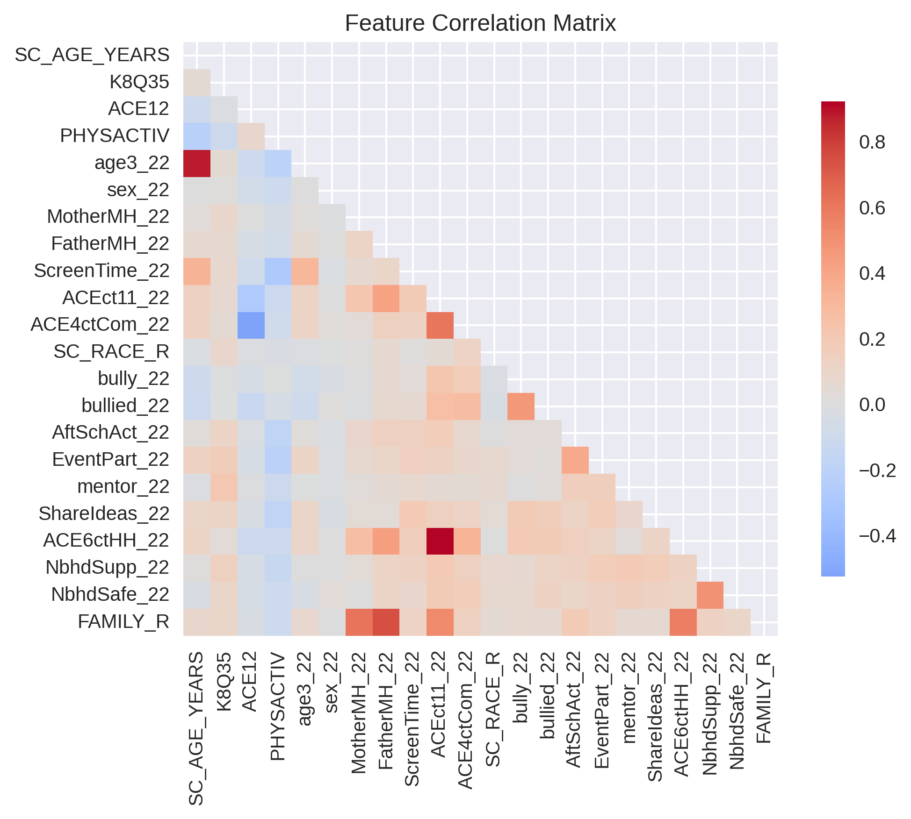

<div id="fig2"></div>

<center>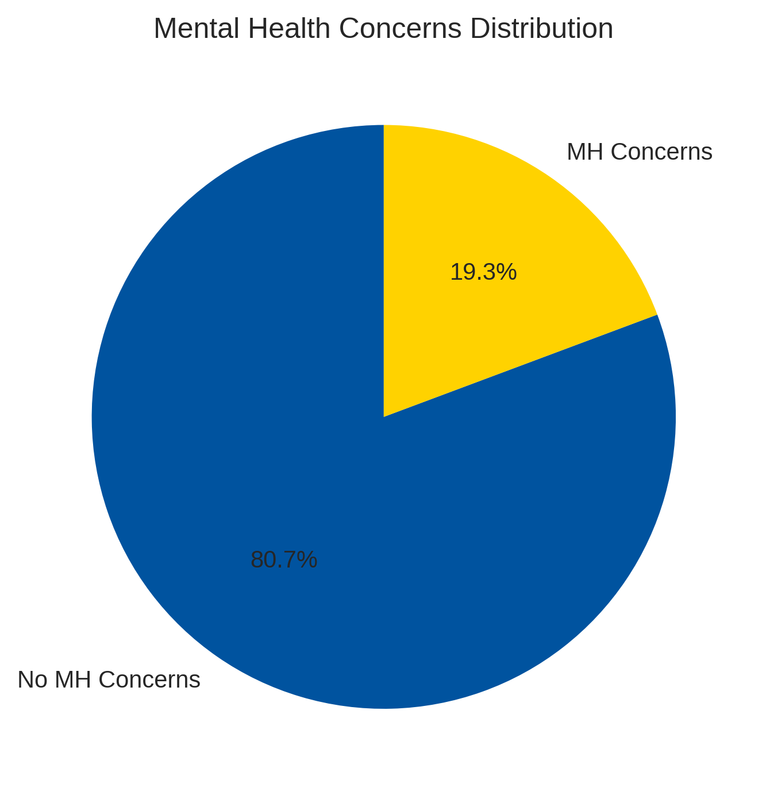

<div id="fig3"></div>

<center>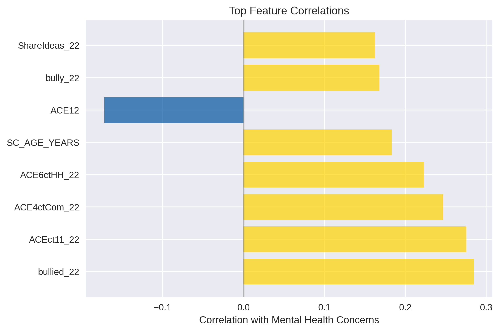

<div id="fig4"></div>

<center>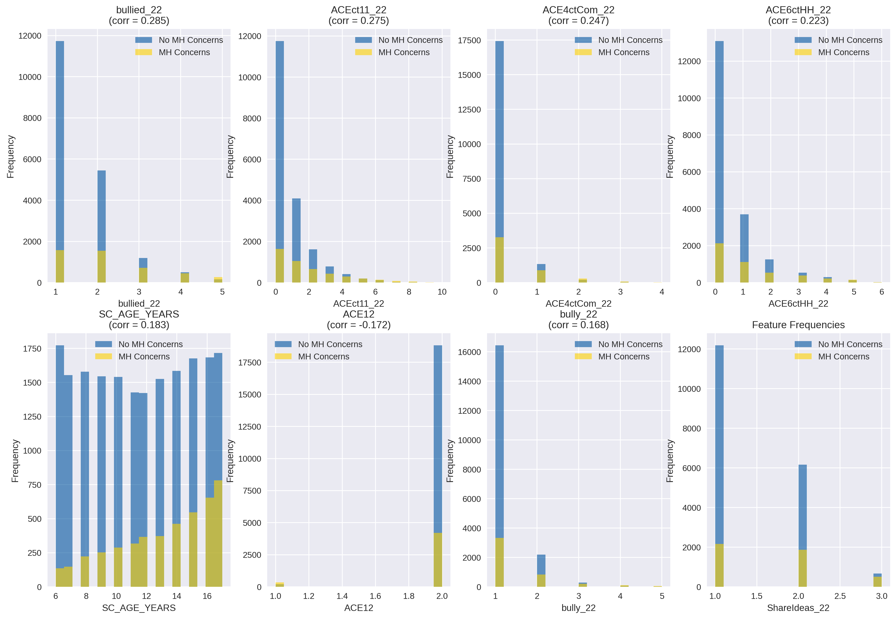

<div id="fig5"></div>

<center>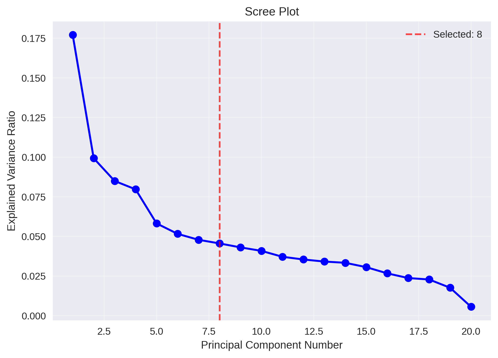

<div id="fig6"></div>

<center>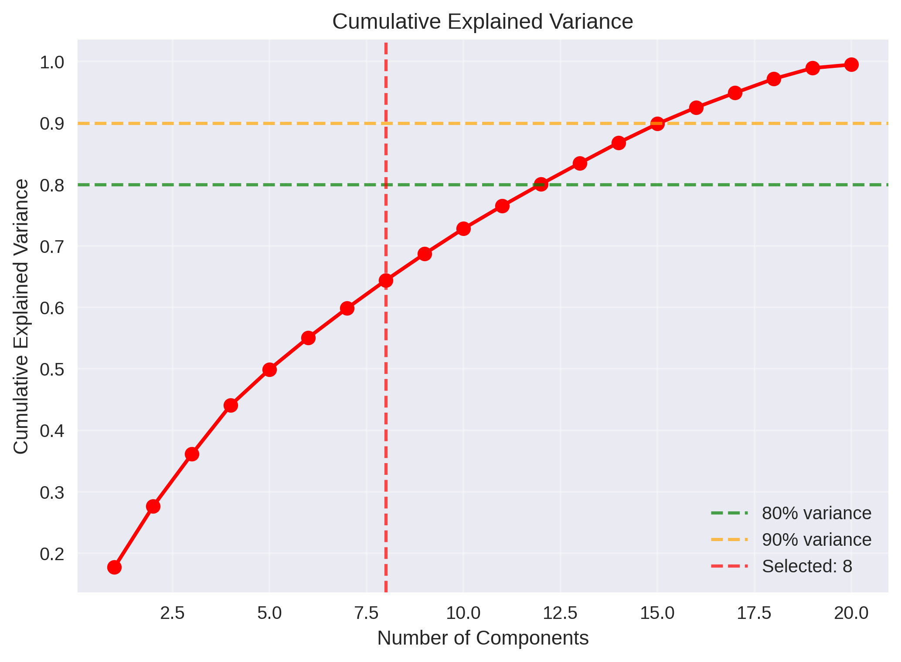

<div id="fig7"></div>

<center>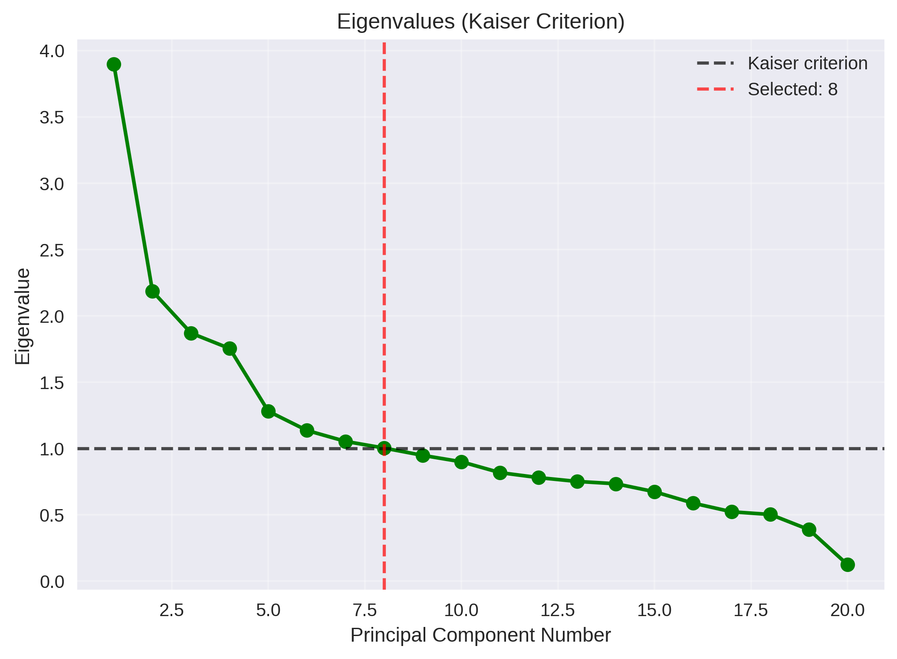

<div id="fig9"></div>

<center>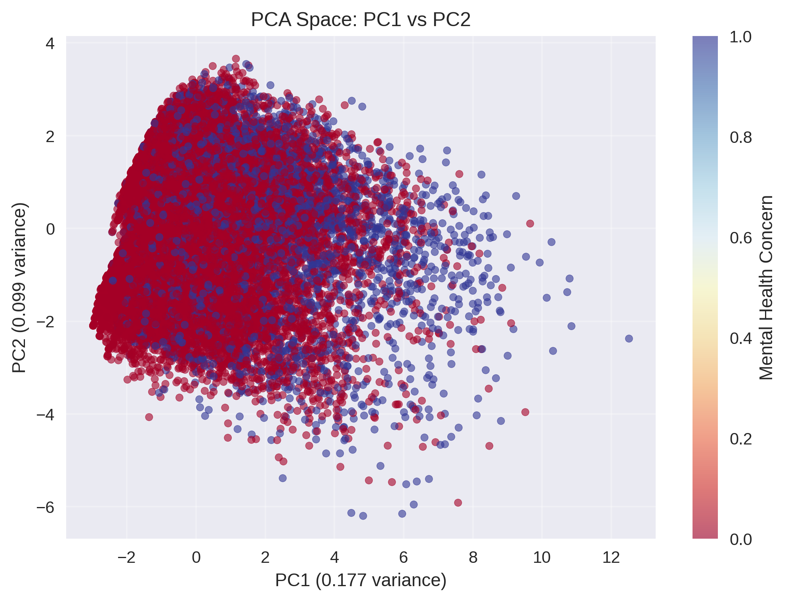

<div id="fig10"></div>

<center>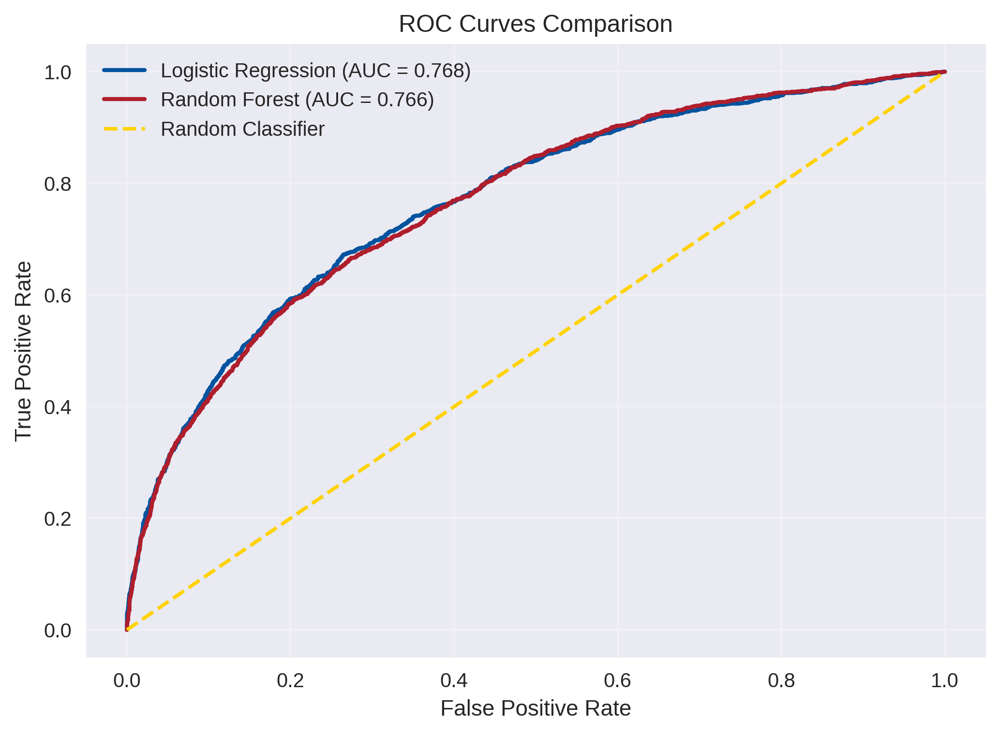

<div id="fig11"></div>

<center>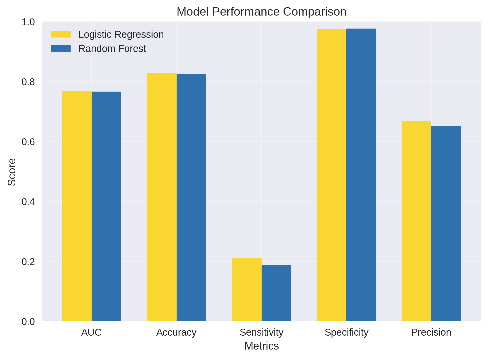

<div id="fig12"></div>

<center>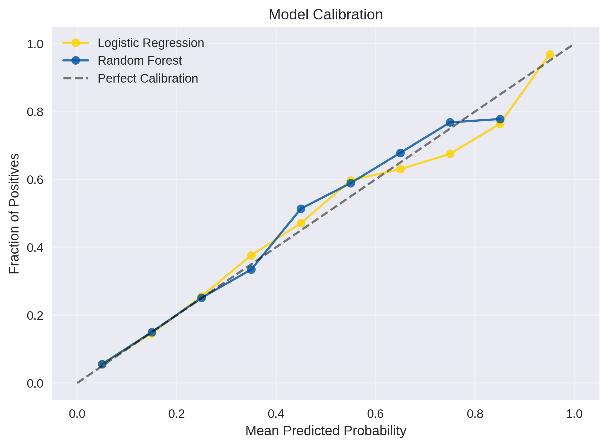

<div id="fig14"></div>

<center>

<div id="fig15"></div>

<center>


\newpage
## Tables

<div id="tab1"></div>

<center>

<div id="tab2"></div>

<center>


\newpage
# Data Dictionary
### Target Variable (Outcome)

**MHealthConcern** - Mental Health Concern (Composite Variable)\
- **Description:** Composite variable indicating if child has current mental health concerns (anxiety or depression)\
- **Construction:** Created from K2Q33B OR K2Q32B = 1 (either currently has anxiety OR currently has depression)\
- **Values:**\
  - 0 = No current mental health concerns\
  - 1 = Has current mental health concerns\
- **Data Type:** Binary (0/1)\

### Outcome Component Variables

**K2Q33A** - Anxiety (Ever Diagnosed)\
- **Description:** Has a doctor or healthcare provider EVER told you that this child has anxiety?\
- **Values:**\
  - 1 = Yes\
  - 2 = No\
- **Data Type:** Categorical\
- **Usage:** Component variable used to construct MHealthConcern target variable\

**K2Q33B** - Anxiety (Currently)\
- **Description:** Does this child CURRENTLY have anxiety?\
- **Values:**\
  - 1 = Yes\
  - 2 = No\
- **Data Type:** Binary\
- **Usage:** Primary component variable used to construct MHealthConcern target variable\

**K2Q32A** - Depression (Ever Diagnosed)\
- **Description:** Has a doctor or healthcare provider EVER told you that this child has depression?\
- **Values:**\
  - 1 = Yes\
  - 2 = No\
- **Data Type:** Categorical\
- **Usage:** Component variable used to construct MHealthConcern target variable\

**K2Q32B** - Depression (Currently)\
- **Description:** Does this child CURRENTLY have depression?\
- **Values:**\
  - 1 = Yes\
  - 2 = No\
- **Data Type:** Binary\

---

### Demographic Variables

**SC_AGE_YEARS** - Child's Age\
- **Description:** Age of the child in years\
- **Values:** Continuous (6-17 years for this analysis)\
- **Data Type:** Numeric\

**sex_22** - Child's Sex\
- **Description:** Sex of the child\
- **Values:**\
  - 1 = Male\
  - 2 = Female\
- **Data Type:** Categorical\

**SC_RACE_R** - Race/Ethnicity\
- **Description:** Race as described in 7 categories\
- **Values:**\
  - 1 = White alone\
  - 2 = Black or African American alone\
  - 3 = American Indian or Alaska Native alone\
  - 4 = Asian alone\
  - 5 = Native Hawaiian and Other Pacific Islander alone\
  - 7 = Two or More Races\
- **Data Type:** Categorical\

**age3_22** - Age Group Categories\
- **Description:** Categorical age groupings\
- **Values:** Age categories (specific ranges need verification from data)\
- **Data Type:** Categorical\

**BORNUSA** - Born in USA\
- **Description:** Binary variable representing if the individual was born in the USA\
- **Values:**\
  - 0 = No\
  - 1 = Yes\
- **Data Type:** Binary\
- **Usage:** Used in analysis as demographic control variable\

---

### Family Environment Variables

**FAMILY_R** - Family Structure\
- **Description:** The family composition/parent situation of the individual\
- **Values:**\
  - 1 = Two biological/adoptive parents, currently married\
  - 2 = Two biological/adoptive parents, not currently married\
  - 3 = Two parents (at least one not biological/adoptive), currently married\
  - 4 = Two parents (at least one not biological/adoptive), not currently married\
  - 5 = Single mother\
  - 6 = Single father\
  - 7 = Grandparent household\
  - 8 = Other relation\
- **Data Type:** Categorical\

**HHCOUNT** - Household Size\
- **Description:** Number of people living in the household\
- **Values:** Continuous (count)\
- **Data Type:** Numeric\
- **Usage:** Used as family environment control variable in analysis\

**MotherMH_22** - Mother's Mental Health\
- **Description:** The status/severity of the mother's mental health\
- **Values:**\
  - 1 = Excellent\
  - 2 = Good\
  - 3 = Fair or Poor\
  - 95 = No mother reported in household as primary caregiver\
  - 99 = Missing values\
- **Data Type:** Categorical\

**FatherMH_22** - Father's Mental Health\
- **Description:** The status/severity of the father's mental health\
- **Values:**\
  - 1 = Excellent\
  - 2 = Good\
  - 3 = Fair or Poor\
  - 95 = No father reported in household as primary caregiver\
  - 99 = Missing values\
- **Data Type:** Categorical\

---

### Social Support Variables

**K8Q35** - Emotional Support Available\
- **Description:** Child has someone to turn to for emotional support\
- **Values:**\
  - 0 = No\
  - 1 = Yes\
- **Data Type:** Binary\

**ShareIdeas_22** - Communication with Parents\
- **Description:** How well children share ideas or talk about things that really matter with their parents\
- **Values:**\
  - 1 = Very Well\
  - 2 = Somewhat Well\
  - 3 = Not at all or Not very well\
- **Data Type:** Categorical\

**mentor_22** - Adult Mentor Availability\
- **Description:** Children have at least one adult mentor\
- **Values:**\
  - 1 = Yes\
  - 2 = No\
  - 90 = Children age 0-5 years (not applicable)\
  - 99 = Missing\
- **Data Type:** Categorical\

**EventPart_22** - Parent Participation in Activities\
- **Description:** Parent participation in the child's activities\
- **Values:**\
  - 1 = Always\
  - 2 = Usually\
  - 3 = Sometimes\
  - 4 = Rarely or never\
  - 90 = Children age 0-5 years (not applicable)\
  - 99 = Missing\
- **Data Type:** Categorical\

---

### Activity and Lifestyle Variables

**PHYSACTIV** - Physical Activity Level\
- **Description:** How many days did this child exercise, play a sport, or participate in physical activity for at least 60 minutes\
- **Values:**\
  - 1 = 0 days\
  - 2 = 1-3 days\
  - 3 = 4-6 days\
  - 4 = Every day\
- **Data Type:** Categorical\

**AftSchAct_22** - After-School Activity Participation\
- **Description:** Whether the child participates in organized activities outside school\
- **Values:**\
  - 0 = No participation\
  - 1 = Participates\
- **Data Type:** Binary\

**ScreenTime_22** - Daily Screen Time\
- **Description:** The number of hours spent on screens daily\
- **Values:** Categorical hours (specific categories need verification)\
- **Data Type:** Categorical\

---

### Adverse Experiences Variables

**ACE12** - Sexual Orientation/Gender Identity Discrimination\
- **Description:** Child experienced "Treated or judged unfairly because of their sexual orientation or gender identity"\
- **Values:**\
  - 0 = No\
  - 1 = Yes\
- **Data Type:** Binary\

**ACEct11_22** - Total ACE Count\
- **Description:** The number of adverse childhood experiences out of 11 possible\
- **Values:** Count (0-11)\
- **Data Type:** Numeric\

**ACE4ctCom_22** - Community-Based ACEs\
- **Description:** Whether the child experienced 1 or more community-based adverse events\
- **Values:**\
  - 1 = No community-based adverse childhood experiences\
  - 2 = Experienced 1 or more community-based ACEs\
- **Data Type:** Binary\

**ACE6ctHH_22** - Household-Based ACEs\
- **Description:** The number of household-based adverse childhood experiences based on 6 household items\
- **Values:** Count (0-6)\
- **Data Type:** Numeric\

---

### Bullying Variables

**bully_22** - Bullying Others\
- **Description:** Whether the child bullies others\
- **Values:**\
  - 1 = Never (in the past 12 months)\
  - 2 = 1-2 times (in the past 12 months)\
  - 3 = 1-2 times per month\
  - 4 = 1-2 times per week\
  - 5 = Almost every day\
- **Data Type:** Categorical\

**bullied_22** - Being Bullied\
- **Description:** Whether the child was bullied by others\
- **Values:**\
  - 1 = Never (in the past 12 months)\
  - 2 = 1-2 times (in the past 12 months)\
  - 3 = 1-2 times per month\
  - 4 = 1-2 times per week\
  - 5 = Almost every day\
- **Data Type:** Categorical\

---

### Neighborhood Environment Variables

**NbhdSafe_22** - Neighborhood Safety\
- **Description:** How safe is the neighborhood where the child lives\
- **Values:**\
  - 1 = Definitely agree (safe)\
  - 2 = Somewhat agree (safe)\
  - 3 = Somewhat/Definitely disagree (not safe)\
- **Data Type:** Categorical\

**NbhdSupp_22** - Neighborhood Support\
- **Description:** Whether children live in a supportive neighborhood\
- **Values:**\
  - 0 = No\
  - 1 = Yes\
- **Data Type:** Binary\

---

### Data Processing Notes

1. **Missing Data Handling:** Multiple imputation was performed using the MICE (Multiple Imputation by Chained Equations) method with 5 imputations and 50 iterations.

2. **Variable Transformations:** Many categorical variables were recoded from their original format (e.g., changing 2s to 0s) to create binary representations where 1 indicates the event occurred/condition present.

3. **Age Filtering:** Analysis focused on children aged 6-17 years.

4. **Target Variable Construction:** MHealthConcern was created as a composite measure combining current anxiety (K2Q33B=1) OR current depression (K2Q32B=1).